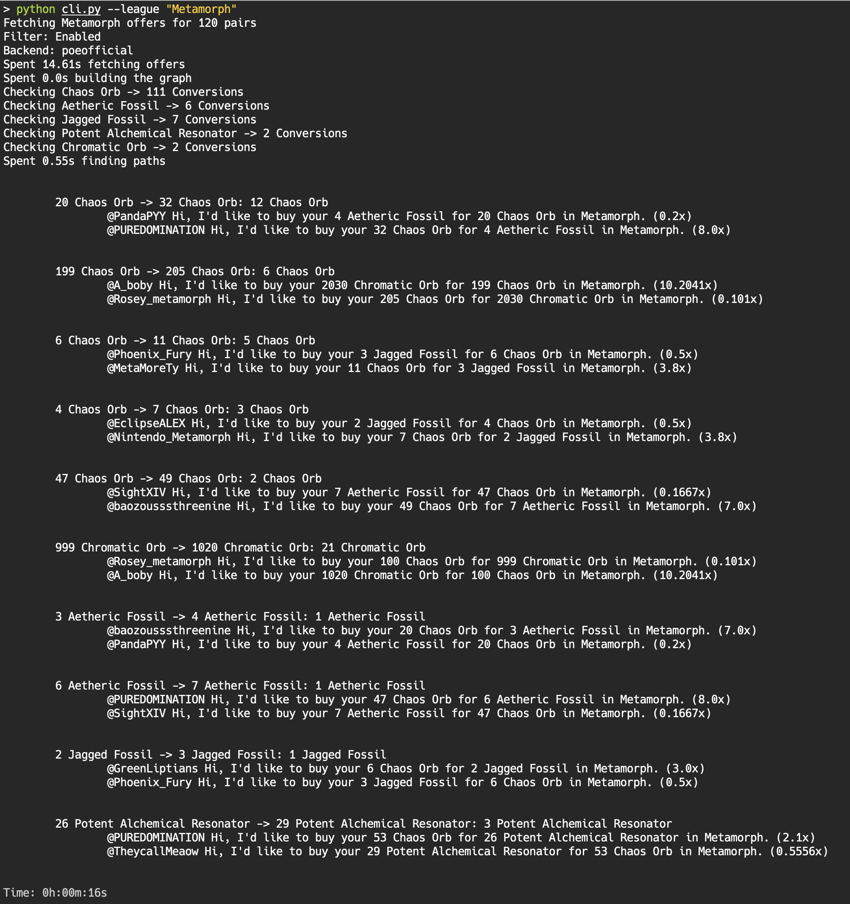

# poe-currency-flip-planner

This tool is an attempt at finding short-term arbitrage deals of currency and items in Path of Exile.

## Background

Trading sites, such as [pathofexile.com/trade](https://pathofexile.com/trade/exchange), provide
pseudo-realtime data about other player's trading offers for items and in-game currency.
Typically, currency items are traded frequently and in larger quantities to remain efficient.
By collecting conversion rates between currencies, you can find series of trades between two
preselected currencies that yield the most arbitrage value at that point in time.

We model this data as a graph, where the currently available conversion rates are
single edges between nodes (currencies).
Given a currency, circular paths of arbitrary length can be found within that graph that
describe different ways to trade the currency for different currencies `x` times until
trading back for the starting currency.

Each of these paths yields one of the following outcomes:

- You have the same amount as before
- You have less than before
- You have more than before

Then we compare these paths to find out which currencies to trade in what order to generate
the most profit.

## How to use

If you simply want to use this tool to find profitable trades,
please use `python cli.py` as a command-line interface.
After a while you will get a bunch of text printed out with your suggested conversions,
as shown below.

By default, it uses [pathofexile.com/trade](https://pathofexile.com/trade/exchange) and
works with currency pairs specified in `config/config.json` (and `config/config.default.json`).
You can also alter this list to your liking to either remove or add trading paths.

If you want to dig in a little, check out `src/cli.py` or `python cli.py --help` for help
and options.

### Exclude Traders

If you want to exclude certain traders you can do so by adding their account name
to your local `excluded_traders.txt` (one name per line).

### Library Usage

If you want to use this project as a library/dependency, feel free to use the
`PathFinder` class (see `src/pathfinder.py`) as an API.

The PathFinder class is a simple interface for finding profitable trade paths for arbitrage.
You give it the league, a list of currencies and a backend instance (eg. `backends/poeofficial.py`).
For each currency it starts looking for all profitable paths that start and end with that
currency, given a maximum transaction length (default: 3).
All stages of data (eg. list of collected offers via the respective trading backend, the
constructed graph of offers and the found profitable paths) are part of each PathFinder
instance and can simply be accessed and used for further work.

## Installation

I highly recommend using [Pipenv](https://github.com/pypa/pipenv) for managing
Python projects and their dependencies.

1. `pipenv shell` to enter a shell session with my environment settings
2. `pipenv install` to install all dependencies
3. `python cli.py <your options>` to run the tool

I use Python >=3.7 for everything. I haven't tried running it with different versions.

## Tests

I wrote a few simple unit tests to make the data fetching and parsing, graph
construction and traversal and path evaluation a bit more robust. You can run
those tests using predefined data structures via `python -m pytest tests`.

## Data Exploration

The data that is used for the analysis is not part of this repository.
If you are interested in it, please message me or collect your own data.
You can use `run_collector.sh` for this.
It starts a `PathFinder` instance (see `src/pathfinder.py`) for each league.
I like running this as a cronjob every 30 minutes.
The collected PathFinder instances are then pickled and persisted in their respective folders,
specified in `run_collector.sh`.

See [here](data_analysis/README.md) for discussion.

### General Workflow (as of now)

1. Collect Data
   `python data_analysis/collector.py --league "Blight" --path "data_analysis/Blight/Softcore"`
2. Merge single `.pickle` files into one `merge.pickle`
   `python data_analysis/converter.py --path "data_analysis/raw/Delve/Softcore"`
3. Run analysis.py
   `python data_analysis/analysis.py --path "data_analysis/raw/Delve/Softcore/merge.pickle"`

## Ideas & Roadmap

See [todo.org](todo.org) (beware of org-mode format from Emacs :)) for ideas, future features, etc. Feel free to send
me any feedback, either via email or PR.
